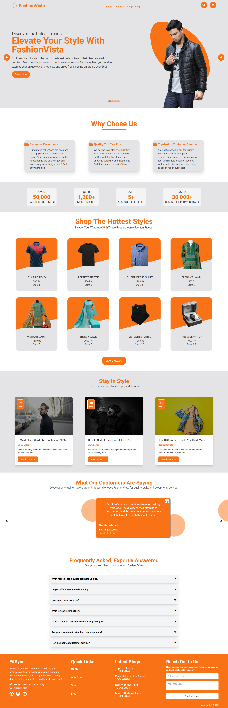

# FashionVista 👗

**FashionVista** is a modern and fully responsive e-commerce landing page built with **React**, **Vite**, **Tailwind CSS**, and **GSAP**. It showcases stylish fashion products with engaging animations, clean UI, and a smooth user experience. This project emphasizes frontend design and animation to deliver a visually appealing, user-friendly interface suitable for a fashion brand or online store.

---

## 🚀 Features

- 🔥 **Animated Landing Page** using **GSAP**
- 🧭 **Smooth Navigation Bar** with hover effects
- 🛍️ **Product Showcase Grid** with ratings and prices
- 📢 **Promotional Hero Section** with call-to-action
- 🧩 **Why Choose Us** information section
- 📰 **Blog Section** to highlight fashion tips
- 💬 **Customer Testimonials** with dynamic styling
- ❓ **FAQ Accordion** for common questions
- 📱 **Fully Responsive Design** across all screen sizes
- 🎨 Built using **React**, **Tailwind CSS**, and **React Icons**

---

## 🛠️ Tech Stack

| Technology       | Usage                                 |
|------------------|----------------------------------------|
| React            | Frontend UI                            |
| Vite             | Development & Build Tool               |
| Tailwind CSS     | Styling & Layout                       |
| GSAP             | Animations                             |
| @gsap/react      | React integration with GSAP            |
| React Icons      | Icon library for UI                    |

---

## 📁 Folder Structure

```
fashionvista/
├── public/
│   └── ...
├── src/
│   ├── assets/             # Images & assets
│   ├── components/         # Reusable UI components
│   ├── pages/              # Main page sections (Home, Shop, Blog, etc.)
│   ├── App.jsx             # Main app layout
│   ├── main.jsx            # App entry point
│   └── index.css           # Tailwind + custom styles
├── tailwind.config.js      # Tailwind configuration
├── vite.config.js          # Vite configuration
├── package.json            # Dependencies and scripts
└── README.md
```

---

## 📦 Installation & Setup

1. **Clone the repository**
   ```bash
   git clone https://github.com/muhammadhussain29/E-Commerce-with-React.git
   cd FashionVista
   ```

2. **Install dependencies**
   ```bash
   npm install
   ```

3. **Start the development server**
   ```bash
   npm run dev
   ```

4. **Build for production**
   ```bash
   npm run build
   ```

5. **Preview the production build**
   ```bash
   npm run preview
   ```

---

## 📸 Screenshots



---

## 🤝 Credits

- Built with ❤️ by [Muhammad Hussain Mughal](https://www.linkedin.com/in/muhammad-hussain-mughal-213069248/)

---

## 📜 License

This project is licensed under the [MIT License](LICENSE).

---

## 🙌 Feedback & Contributions

Feel free to fork the repo, raise issues, or submit PRs if you find ways to improve this project.
